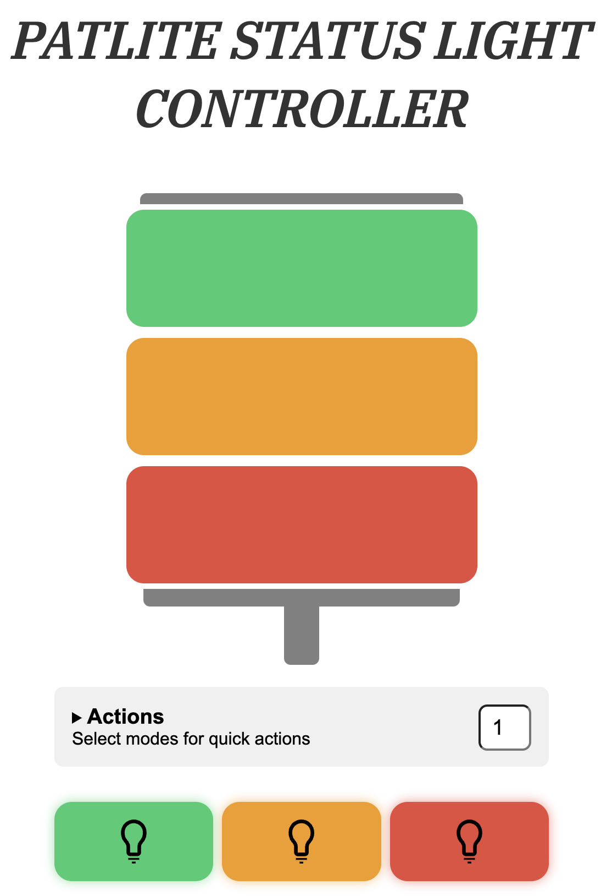

# PATLITE light tower controller

## Frontend setup & run

### setup

```
cp .env.exmaple .env
```

### build

```
cd frontend
yarn
yarn build

# docker build
build -t patlite-light-tower-controller .
```

## Server setup & run

```
cd server
virtualenv env
source env/bin/activate

pip3 install -r requirements.txt
python3 main.py

or

python3 --server main.py
```

## Screenshot of homepage


